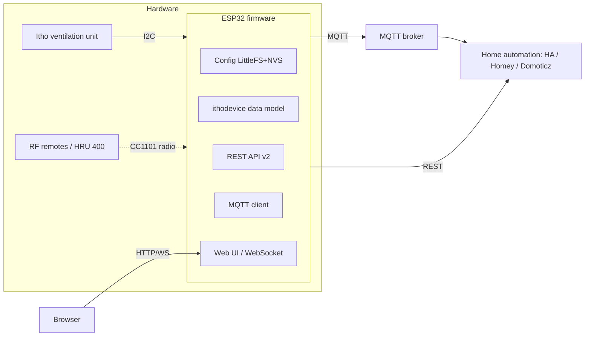
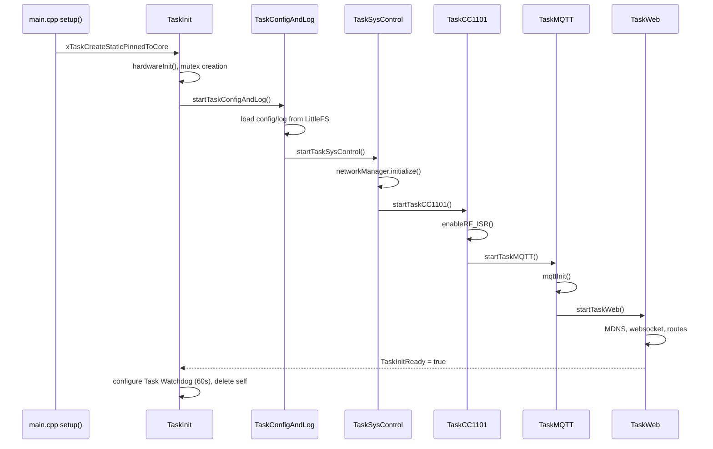
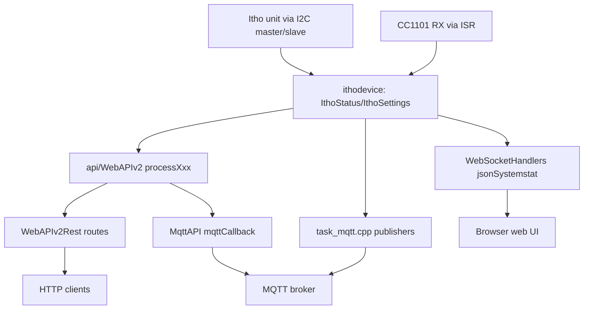
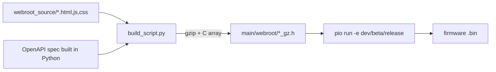

# Repository Map

> AI-agent-oriented architecture reference. For condensed/linked version see [.ai/architecture-summary.md](../../.ai/architecture-summary.md). Do not duplicate this content elsewhere — link to it.

## Scope note

This repo mixes firmware source with vendored third-party libraries and generated build output. **Never treat these as project code**:

| Path | What it is |
|---|---|
| `software/lib/*` | Vendored/pinned third-party libraries (ArduinoJson, AsyncTCP, ESPAsyncWebServer, PubSubClient, etc.) — do not edit |
| `software/NRG_itho_wifi/.pio/` | PlatformIO build cache/output — generated |
| `main/webroot/*_gz.h` | Generated gzip C headers from `build_script.py` — generated, do not hand-edit |
| `venv/` | Local Python venv |

Project firmware source lives under `software/NRG_itho_wifi/main/`. Native unit tests live under `software/NRG_itho_wifi/test/`. Live-hardware integration tests live under `tests/` (repo root).

## High-level architecture

## Folder responsibilities

| Folder | Responsibility |
|---|---|
| `main/tasks/` | FreeRTOS task entry points; the boot chain and each task's main loop |
| `main/managers/` | Global singleton managers owning hardware/network/RF/I2C state |
| `main/api/` | REST v2 logic (`WebAPIv2.cpp`) + routing (`WebAPIv2Rest.cpp`), legacy v1, MQTT command dispatch, OpenAPI serving |
| `main/handlers/` | Web route handlers (files, websocket JSON builders, I2C query registration) |
| `main/ithodevice/` | Device data-model (per-device tables), status/settings parsing, I2C transport, virtual remote commands |
| `main/ithodevice/devices/` | Per-device-model label/mapping headers included into the device table |
| `main/cc1101/` | CC1101 SPI radio driver + Itho RF protocol decode layer |
| `main/config/` | Config structs + LittleFS/NVS load/save |
| `main/webroot_source/` | Hand-authored web UI source (HTML/JS/CSS fragments) |
| `main/webroot/` | Generated gzip C headers built from `webroot_source/` — do not edit |
| `software/NRG_itho_wifi/test/test_native_*/` | Host-side Unity unit tests (pure-logic extraction) |
| `tests/api/`, `tests/mqtt/` | pytest integration tests against **real hardware** (`ITHO_DEVICE` env var) |
| `docs/`, `.ai/`, `specs/`, `docs/adr/` | AI/human documentation framework (this file's family) |
| `release_notes/` | Per-version release notes, one file per version |

## Boot / task-chain flow

Boot is a **linear chain**, not a queue pipeline: each task starts the next task before entering its own loop. Single core (`CONFIG_ARDUINO_RUNNING_CORE`), static stacks.

| Task | Entry (file:line) | Priority | Stack | Notes |
|---|---|---|---|---|
| TaskInit | `main/tasks/task_init.cpp:8` | 5 | 4096 | Boot orchestrator, deletes itself once chain is up |
| TaskConfigAndLog | `main/tasks/task_configandlog.cpp:43` | 5 | 6144 | Loads config/log files |
| TaskSysControl | `main/tasks/task_syscontrol.cpp:54` | **6** (highest) | 6144 | Network init |
| TaskCC1101 | `main/tasks/task_cc1101.cpp` (create ~line 258) | 5 | 4096 | RF radio task, owns ISR enable/disable |
| TaskMQTT | `main/tasks/task_mqtt.cpp:40` | 5 | 6144 | MQTT init, topic publish |
| TaskWeb | `main/tasks/task_web.cpp:50` | 5 | 6144 | Web server/websocket, loops `execWebTasks()` every 25ms |
| sniffer_task | `main/ithodevice/i2c_sniffer.cpp:208` | 17 (highest overall) | 4096 | Passive I2C bus sniffer, only on sniffer-capable hardware |

**Synchronization primitives actually used** (task-to-task signaling is polled flags; the one FreeRTOS queue is the I2C sniffer's ISR event queue, `gpio_evt_queue` in `main/ithodevice/i2c_sniffer.cpp`):
- `SemaphoreHandle_t isrSemaphore` — guards CC1101 RX in ISR `ITHOinterrupt` (`main/tasks/task_cc1101.cpp:34,36`)
- `mutexJSONLog`, `mutexWSsend` — created `main/tasks/task_init.cpp:13-14`
- `I2CManager::queueMutex` (`main/managers/I2CManager.h:21`) — guards a `std::deque<std::function<void()>>` command queue
- Most cross-task signaling is **polled global flags** (e.g. `send31D9`, `sysStatReq`, `saveSystemConfigflag`, `updateIthoMQTT`), not RTOS primitives. Do not assume queue-based messaging exists when reasoning about concurrency.

## Runtime data flow

## Build pipeline

`build_script.py` (`software/NRG_itho_wifi/build_script.py`): `concat_controls_js()` merges JS fragments, `make_c_header()` gzips each asset into a C byte array, `build_webui()` writes `main/webroot/*_gz.h`, `build_openapi_spec()` generates the OpenAPI 3.0 spec into `main/webroot/openapi_json_gz.h` (the standalone `docs/openapi.json` is maintained separately, not emitted by this script). Generated headers are `#include`d directly by `main/tasks/task_web.cpp` and served as static gzip responses — **no runtime filesystem storage of the UI**.

## Important entry points

| Entry point | File:line |
|---|---|
| `setup()` | `main/main.cpp:12` |
| `loop()` (watchdog feed only) | `main/main.cpp:33` |
| `mqttCallback` (inbound MQTT command parse) | `main/api/MqttAPI.cpp:24` |
| `ITHOinterrupt` (RF RX ISR, `IRAM_ATTR`) | `main/tasks/task_cc1101.cpp:36` |
| REST v2 route table | `main/api/WebAPIv2Rest.cpp` (~lines 890-1120) |
| Device table | `ithoDevices[]`, `main/ithodevice/IthoDevice.cpp:35` |

## Config persistence

Backend: **LittleFS JSON** files, with an **NVS snapshot of all config types** taken before a flash repartition (`backupAllConfigs()`, `main/esp32_repartition.cpp`) and restored on the next boot via the `nvs_backup_key` load path (`loadConfigFile`/`loadFileRemotes`, `main/config/Config.cpp`). Config structs: `SystemConfig`, `WifiConfig`, `LogConfig`, `HADiscConfig`, `IthoRemote` — see `main/config/*.h`. Loaded from `TaskConfigAndLog`/`TaskSysControl`, save/reset triggered by polled flags (`saveSystemConfigflag`, `resetWifiConfigflag`).

## Related docs

- Condensed agent context: [.ai/architecture-summary.md](../../.ai/architecture-summary.md), [.ai/context-map.md](../../.ai/context-map.md)
- Architecture decisions: [docs/adr/README.md](../adr/README.md), especially ADR-0002 through ADR-0009
- Spec workflow: [specs/index.md](../../specs/index.md)
