# Itho WiFi add-on — Gebruikershandleiding

**Versie:** V1.13

**Datum:** 14-06-2026

| | |
|---|---|
| 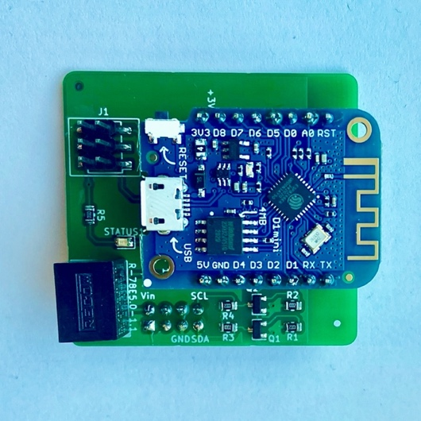 | 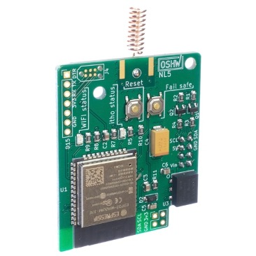 |
| **CVE add-on revisie 1.x** | **CVE add-on revisie 2.x** |
| 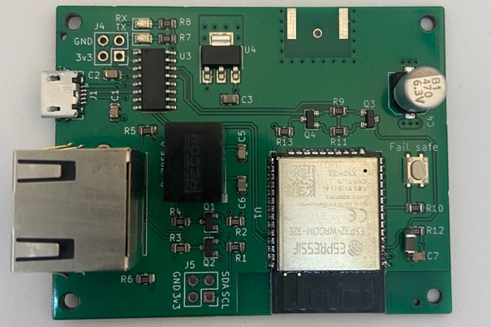 | |
| **Non-CVE add-on revisie 1.x** | |

---

## Inhoudsopgave

- [Voorwoord](#voorwoord)
- [Fysieke Installatie CVE Add-on](#fysieke-installatie-cve-add-on)
- [Fysieke Installatie non-CVE Add-on](#fysieke-installatie-non-cve-add-on)
- [Extra informatie voor de HRU250 en HRU300](#extra-informatie-voor-de-hru250-en-hru300)
- [Add-on Instellen](#add-on-instellen)
- [Gebruik (Webinterface, API)](#gebruik-webinterface-api)
- [Apparaat-specifieke informatie](#apparaat-specifieke-informatie)
- [Temperatuur/Vochtsensor](#temperatuurvochtsensor)
- [Virtual Remote](#virtual-remote)
- [RF-Module](#rf-module)
- [Firmware bijwerken](#firmware-bijwerken)
- [Module resetten](#module-resetten)
- [Hmmm, maar…. Waar vind ik verdere informatie?](#hmmm-maar-waar-vind-ik-verdere-informatie)
- [Hardware revisies](#hardware-revisies)
- [Installatievoorbeeld](#installatievoorbeeld)
- [Node-RED automatiseringsvoorbeeld](#node-red-automatiseringsvoorbeeld)
- [Ondersteunde afstandsbedieningen](#ondersteunde-afstandsbedieningen)

---

## Voorwoord

Bedankt voor de aanschaf van een (of meerdere) add-on modules, veel plezier met het gebruik!

Een belangrijke waarschuwing vooraf! Verschillende Itho apparaten (in ieder geval de CVE's en HRU200) zijn niet aanraakveilig als er spanning op staat, ook de laag voltage delen niet. Haal daarom altijd de spanning van het apparaat bij het installeren van een add-on op de printplaat. Zo voorkom je schade aan jezelf en je itho! Indien nodig, bedien de knopjes op de printplaat van de CVE add-on alleen met materiaal dat geen stroom kan geleiden.

Dit is een beknopte handleiding om je op weg te helpen de add-on fysiek te installeren en te verbinden met je eigen wifi netwerk. Informatie over verdere specifieke installaties is online te vinden.

Deze handleiding, de plug-ins voor oa. Home Assistant en Homey, de wiki en verdere informatie online zijn een community effort, een verzameling van bijdragen van gebruikers voor gebruikers. Zonder deze bijdragen was oa. dit document er niet geweest. Het wordt zeer gewaardeerd als je aanvullingen, aanpassingen en/of suggesties hebt!

**Bronnen waar verdere informatie te vinden is:**

- Wiki pagina: <https://github.com/arjenhiemstra/ithowifi/wiki>
- Tweakers.net forum: <https://gathering.tweakers.net/forum/list_message/82125986>
- Tweakers.net forum (WPU specifiek): <https://gathering.tweakers.net/forum/list_messages/2154474>
- Meest gestelde vragen: <https://gathering.tweakers.net/forum/list_messages/1976492/0#label-faq>

---

## Fysieke Installatie CVE Add-on

Om de add-on (PCB) goed te beschermen, leveren wij deze in een antistatisch zakje.

Hieronder volgt een genummerde lijst met handelingen, om de installatie van de add-on te realiseren.

1. Haal de add-on uit het antistatische zakje;
2. U treft naast de add-on, ook een PCB-afstandshouder aan, leg deze even apart.
3. Haal nu de spanning van de Itho ventilatie-unit, door de stekker uit de wandcontactdoos te halen;
4. Om bij de basisprint van de Itho te komen, haalt u de deksel van de unit. Dat kan door met een platte schroevendraaier de klemnokken aan de boven- en onderzijde te ontgrendelen. U ziet nu het kastje waarin de basisprint zit, deze is eenvoudig te bereiken door het deurtje te openen of in geval van een zwarte kap kan deze verwijderd worden door wat zijwaartse druk te combineren met een trek beweging naar boven. Zie de installatie & gebruik handleiding van de fabrikant, voor eventuele andere/specifieke instructies;
5. Plaats nu de PCB-afstandshouder met de kromme / korte kant in het gat op de itho basisprint dat overeenkomt met het gat op de add-on. Door gebruik van deze afstandshouder reduceert de kans, dat door trillingen, gesoldeerde punten mogelijk lostrillen. Eventueel kan deze stap ook na het testen van de add-on gedaan worden;
6. Het plaatsen van de add-on, benodigd geen speciaal gereedschap of andere materialen.
   U kunt, de add-on plaatsen door deze op de 2×4 pin interface aan te brengen.
   Zie Installatievoorbeeld, in het rood omcirkeld, waar de 2×4 pin interface zich bevindt op de basisprint;
7. Breng nu de spanning van de Itho terug door de stekker in de wandcontactdoos te plaatsen.
8. Als de initialisatie succesvol is, licht de Itho status led (zie Hardware revisies) kort op. Vervolgens blijft deze uit. Dit is een teken dat de communicatie, tussen de Itho basis/hoofdprint en add-on succesvol is gestart. De wifi status led zal knipperen als indicatie dat er een access point gestart is.
9. Nu is de add-on geïnstalleerd, sluit het kastje van de basisprint en plaatst u de deksel terug op de unit.

---

## Fysieke Installatie non-CVE Add-on

Om de add-on (PCB) goed te beschermen, leveren wij deze in een antistatisch zakje. Indien u een behuizing mee besteld hebt is de add-on al in de behuizing geplaatst. Laat de add-on in de behuizing zitten, het verwijderen van de print uit de behuizing kan de behuizing beschadigen.

Hieronder volgt een genummerde lijst met handelingen, om de fysieke installatie van de add-on te realiseren.

1. Haal, indien van toepassing, de add-on uit het antistatische zakje;
2. Zoek de COM/Service poort op je Itho device. Dit is aansluiting die lijkt op een netwerkpoort (RJ45 connector). Sluit de add-on met een goede, korte (CAT6a, STP, 25cm) netwerk kabel aan op de COM/Service poort;
3. De add-on is geïnstalleerd en zal een access point starten.

**Nb.** Stroom voor de add-on komt via de netwerkkabel vanuit de aangesloten Itho. In uitzonderlijke gevallen lijkt de Itho niet voldoende stroom te kunnen leveren (bepaalde revisies van de HRU300). Hierdoor is de communicatie met de HRU niet altijd stabiel. Sluit in dat geval een USB voeding aan op de add-on. In alle andere gevallen is dit niet nodig.

---

## Extra informatie voor de HRU250 en HRU300

Om de add-on te kunnen gebruiken met de HRU250 en HRU300 zijn een adapter bordje en PCI-e splitter kabel nodig.

Om deze te installeren:

1. Verwijder de PCI-e kabel uit de HMI van de HRU.
2. Sluit de PCI-e kabel van de HMI aan op de PCI-e splitterkabel.
3. Sluit 1 kant van de splitterkabel aan op de HMI, sluit de overgebleven kant aan op het HRU250/300 adapter bordje.
4. Met de netwerkkabel kan het adapter bordje verbonden worden met de add-on.

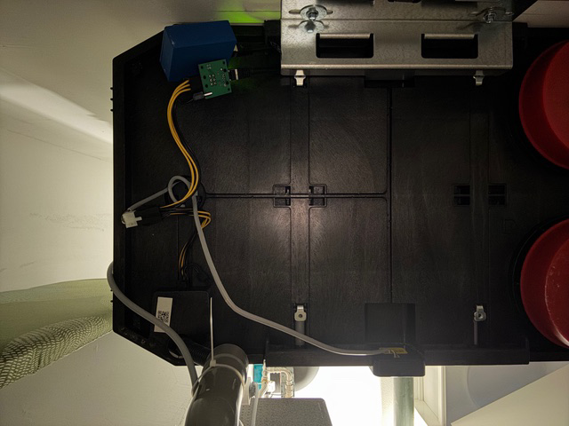

### Bediening van de HRU250 en HRU300

Deze modellen zijn iets beperkter in de bediening via de add-on in vergelijking met andere Itho modellen. Om deze HRU te bedienen moet je gebruik maken van de CC1101 RF module op de add-on. De Virtual Remote optie werkt bij deze HRU modellen niet.

Om gebruik te maken van de RF module moet deze via de web interface van de add-on geactiveerd worden, dat kan onder het menu "System settings". Na een reboot komt er een menu item bij genaamd "RF Devices". Hier kan een RF device geconfigureerd worden. Dit RF device moet vervolgens gekoppeld worden aan de HRU. Volg hiervoor dezelfde procedure als waarmee ook fysieke remotes gekoppeld worden.

---

## Add-on Instellen

Hieronder treft je een genummerde lijst met stappen om de basis instellingen van de add-on te maken.

### Add-on instellen — *Verbinden met de add-on*

1. Na het aansluiten start de add-on automatisch een WiFi access point. De WiFi status led knippert dan 1x per seconde (zie Hardware revisies).

   Let op: zolang de add-on nog geen verbinding heeft met je WiFi-netwerk, blijft het access point actief. Zodra de add-on verbonden is, schakelt het access point na de ingestelde tijd (standaard 15 minuten) automatisch uit. Deze tijd is aan te passen in de instellingen.

2. Maak met je telefoon, tablet of computer verbinding met het WiFi netwerk van de add-on:
   - Netwerknaam (SSID): **nrg-itho-XXXX** (de laatste 4 tekens zijn uniek per add-on)
   - Wachtwoord: **password**

3. Open een browser en ga naar:
   `http://nrg-itho-XXXX.local` (vervang XXXX door de 4 tekens uit de netwerknaam)
   Werkt dit niet (bijv. op Android)? Ga dan naar <http://192.168.4.1>

### Add-on instellen — *Setup Wizard*

Vanaf firmware versie 3.0 start automatisch een Setup Wizard die je in een aantal stappen door de configuratie leidt:

**Stap 1 — WiFi**

Vul de naam (SSID) en het wachtwoord van je eigen WiFi netwerk in. Optioneel kun je een eigen hostname instellen. Klik op Connect en wacht tot de verbinding bevestigd wordt. Noteer het IP-adres dat getoond wordt — dit heb je nodig om de add-on later te bereiken vanuit je eigen netwerk.

**Stap 2 — Device**

De wizard detecteert automatisch welk type Itho apparaat is aangesloten (bijv. CVE-Silent, HRU 350, DemandFlow) en stelt de meest voorkomende standaardinstellingen in. Bij apparaten zonder I2C-verbinding (bijv. HRU 400) wordt de optie aangeboden om RF standalone modus te activeren.

**Stap 3 — RF** (wordt overgeslagen als er geen CC1101 RF module aanwezig is)

Hier configureer je de RF-afstandsbedieningen. Je kunt een afstandsbediening koppelen (join) met de Itho apparaat, of deze stap overslaan en later via het menu "RF Devices" instellen.

Werk je in RF-standalone modus (een apparaat zonder I2C, bijvoorbeeld de HRU 400)? Dan is dit het moment om een geëmuleerde RFT CO2-remote aan de Itho te koppelen — daarmee stuur je het apparaat vervolgens aan en lees je de status uit.

**Stap 4 — MQTT** (optioneel)

Vul de gegevens van je MQTT server in als je de add-on wilt koppelen aan Home Assistant, Domoticz of een ander domotica platform via MQTT. Schakel eventueel Home Assistant MQTT Auto Discovery in zodat de add-on automatisch als apparaat in Home Assistant verschijnt.

**Stap 5 — HA Discovery** (wordt overgeslagen als MQTT niet is ingeschakeld)

Configureer welke sensoren en statusinformatie via HA Auto Discovery beschikbaar worden gesteld aan Home Assistant.

### Add-on instellen — *Na de wizard*

Verbind je telefoon/computer weer met je eigen WiFi netwerk en open de browser op het IP-adres uit de wizard.

Alle instellingen zijn ook achteraf aan te passen via de web interface. De wizard hoeft niet opnieuw doorlopen te worden.

---

## Gebruik (Webinterface, API)

De Itho unit is nu d.m.v. de web interface (<http://nrg-itho-A1B2.local>, A1B2 vervangen), via MQTT of WebAPI te bedienen.

Wil je de add-on via MQTT koppelen aan domotica? Dan heb je een MQTT-server (broker) nodig. De web interface en de WebAPI werken overigens ook zonder MQTT. Heb je nog geen MQTT-server, dan vind je via onderstaande link een prima voorbeeld hoe je deze installeert op bijvoorbeeld een Raspberry Pi:

<https://randomnerdtutorials.com/how-to-install-mosquitto-broker-on-raspberry-pi/>

### Itho bedienen

Er zijn verschillende mogelijkheden om de Itho te bedienen en de settings aan te passen.

Voor CVE's en de HRU 200 zijn er 2 manieren om de snelheid te regelen: remote-commando's (virtual of RF) en het traploze PWM2I2C-protocol. Voor andere apparaten (bijvoorbeeld de HRU 350) zijn alleen de remote-commando's (virtual remote en/of RF-remote) beschikbaar. Voor de HRU 250 en HRU 300 werken uitsluitend RF-remote commando's. Om RF-remote commando's te versturen moet de CC1101 RF-module aanwezig zijn op de add-on. Virtual-remote commando's (waarbij de add-on een fysieke remote emuleert) worden via de fysieke I2C-verbinding met de Itho verstuurd.

Wat per apparaat precies mogelijk is, staat in het hoofdstuk [Apparaat-specifieke informatie](#apparaat-specifieke-informatie).

Meer details over de verschillende mogelijkheden en de eventuele beperkingen zijn op de wiki te vinden:

<https://github.com/arjenhiemstra/ithowifi/wiki/Controlling-the-speed-of-a-fan>

### Koppeling met Home Domotica software

De add-on kan met andere apparaten en domotica gekoppeld worden via MQTT en de WebAPI. De details hiervan staan in het kopje *De API gebruiken* hieronder.

Voor de meest gebruikte platforms zijn er kant-en-klare integraties:

- **Home Assistant — MQTT Auto Discovery.** Schakel je MQTT in met Home Assistant MQTT Auto Discovery, dan wordt de add-on automatisch als apparaat in Home Assistant geconfigureerd met een basis configuratie. Deze kan handmatig aangepast en uitgebreid worden.
- **Home Assistant — losse integraties.** Er zijn daarnaast twee community-integraties voor Home Assistant:
  - [ithowifi-ha-integration](https://github.com/arjenhiemstra/ithowifi-ha-integration) — gebruikt de REST API (lokaal, eenvoudig).
  - [haithowifi](https://github.com/jasperslits/haithowifi) — gebruikt de MQTT API (uitgebreider).
- **Homey.** De [Itho Daalderop-app](https://homey.app/en-nl/app/nl.monkeysoft.nrgwatch/Itho-Daalderop/) in de Homey app store gebruikt de WebAPI (REST); MQTT is daarvoor niet nodig.
- **Homebridge (Apple HomeKit).** De community-plugin [Homebridge Itho Daalderop HUE](https://github.com/SanderBaron/homebridge-itho-daalderop-HUE) brengt je CVE naar Apple HomeKit. Hij communiceert via de WebAPI of MQTT (MQTT aanbevolen voor directe updates) en biedt optioneel een koppeling met Philips Hue.
- **Domoticz en andere platforms.** Koppeling verloopt via MQTT (of de WebAPI).

### De API gebruiken (WebAPI en MQTT)

De add-on heeft twee API's waarmee je de Itho kunt uitlezen en bedienen, bijvoorbeeld vanuit eigen scripts of domotica: een **WebAPI** (HTTP) en een **MQTT API**. Beide accepteren dezelfde commando's.

De volledige en altijd actuele lijst met endpoints en commando's voor jouw firmwareversie vind je in de web interface onder het menu **API** (interactieve documentatie). De onderliggende OpenAPI-specificatie is ook rechtstreeks op te halen via `http://<add-on>/api/openapi.json`.

**WebAPI (HTTP)**

Er zijn twee varianten:

- **REST API (v2)** — een JSON-API onder `/api/v2/…`. Een greep uit de endpoints:
  - `GET /api/v2/deviceinfo` — apparaat- en firmware-informatie
  - `GET /api/v2/ithostatus` — alle actuele statuswaarden
  - `GET /api/v2/speed` en `GET /api/v2/lastcmd` — huidige snelheid en laatste commando
  - `GET /api/v2/remotes`, `/api/v2/vremotes` en `/api/v2/rfstatus` — (virtuele) remotes en RF-status
  - `GET` en `PUT /api/v2/settings` — instellingen uitlezen en wijzigen
  - `POST /api/v2/command` — een commando sturen (bijvoorbeeld een ventilatiestand)
  - `POST /api/v2/vremote` en `POST /api/v2/rfremote/command`, `/co2`, `/demand`, `/config` — virtual- en RF-remote commando's
  - `POST /api/v2/wpu/outside_temp` en `/api/v2/wpu/manual_control` — WPU-specifiek
- **Legacy API (v1)** — eenvoudige uitlees-API in query-stijl via `/api.html`, bijvoorbeeld:
  - `http://<add-on>/api.html?get=ithostatus`
  - `http://<add-on>/api.html?get=currentspeed` (overige waarden: `lastcmd`, `queue`, `remotesinfo`)

  Het uitlezen en wijzigen van instellingen is verplaatst naar de REST API (`GET`/`PUT /api/v2/settings`).

**MQTT API**

Als MQTT is geconfigureerd, gebruikt de add-on onderstaande topics. Het *base topic* is instelbaar (standaard `itho`):

- `itho/cmd` — publiceer hier je commando's naar de add-on (dezelfde set als de WebAPI).
- `itho/cmd/response` — het antwoord van de add-on op een commando.
- `itho/state` — hier publiceert de add-on een JSON met alle statuswaarden.
- `itho/lwt` — de online/offline status van de add-on (Last Will & Testament).

Een werkend voorbeeld (Node-RED) dat naar `itho/cmd` publiceert, staat in het [Node-RED automatiseringsvoorbeeld](#node-red-automatiseringsvoorbeeld).

---

## Apparaat-specifieke informatie

De add-on herkent automatisch welk Itho-apparaat is aangesloten en past de beschikbare instellingen en uitleesbare statuswaarden daarop aan. Hieronder staat per apparaat(groep) hoe het wordt aangestuurd, welke informatie de add-on uitleest en waar je op moet letten.

Naast de hieronder per apparaat beschreven aansturing kan vanaf de add-on bij **elke ventilator (CVE en HRU)** en **DemandFlow** een RFT CO2-remote geëmuleerd worden. Na koppeling met het apparaat kan het daarmee traploos van 0–100% aangestuurd worden, in stapjes van een half procent. Dit werkt zowel bij een I2C-aansluiting als in RF-standalone modus. Alleen bij de CVE's kan deze RF-communicatie minder betrouwbaar zijn; zie het hoofdstuk *CVE-familie* hieronder.

> **Let op:** welke statuswaarden en instellingen precies beschikbaar zijn, hangt af van het model én de firmwareversie van het Itho-apparaat. De web interface en de API-pagina tonen altijd de actuele, volledige lijst voor jouw apparaat. De waarden hieronder zijn voorbeelden van wat een apparaat zoal rapporteert.

### CVE-familie (CVE, CVE-Silent, HRU 200)

**Modellen:** CVE, CVE-Silent en de HRU 200 (in de web interface herkend als *CVE-SilentExtPlus*). Ook de CVE ECO2 en CVE-SilentExt worden herkend, maar bieden alleen basisstatus.

**Aansturing:** deze units communiceren via de fysieke I2C-verbinding op de basisprint. De snelheid kan op twee manieren geregeld worden:

- **Remote-commando's** — een *virtual remote* die de add-on emuleert, of een fysieke/RF-remote (RF vereist de CC1101-module).
- **PWM2I2C** — een traploos protocol voor staploze regeling (0–100%). Dit is alleen beschikbaar op de CVE's en de HRU 200, niet op de andere apparaten.

Standaard staat de add-on in PWM2I2C-modus; de remote-modus kun je instellen via *System settings*.

> **Let op (modellen met ingebouwde CO2-sensor):** bij CVE-S Optima Inside-modellen met een ingebouwde CO2-sensor werkt PWM2I2C niet — de PWM2I2C-commando's worden overruled door de interne CO2-sensor. Gebruik bij deze modellen virtual remote-aansturing.

**Wat de add-on uitleest (o.a.):** ventilatieniveau/-setpoint (%), gevraagd en actueel toerental (rpm), gekozen stand, foutcode, opstartteller, bedrijfsuren, **CO2-waarde (ppm)**, klepstand en aanwezigheidstimer. Nieuwere CVE's hebben een ingebouwde vochtsensor — zie het hoofdstuk [Temperatuur/Vochtsensor](#temperatuurvochtsensor).

De **CVE-Silent** meldt aanvullend onder meer de hoogst gemeten CO2 (ppm) en RH (%), de interne luchtvochtigheid (%) en temperatuur (°C) en afwezigheidstimers. De **HRU 200** heeft de meest uitgebreide set van de familie, met daarnaast onder meer filtergebruik (uren), buiten- en afblaastemperatuur, gemiddelde uitblaastemperatuur, bypassmodus en -stand, en de maximale CO2-/RH-niveaus.

> **Let op (RF bij CVE's):** bij de CVE's zitten de antennes van de add-on en de unit dicht bij elkaar. Dit kan bij RF-aansturing (zoals een geëmuleerde RFT CO2-remote) tot communicatieproblemen leiden. Gebruik bij de CVE's daarom bij voorkeur de I2C-aansturing (virtual remote of PWM2I2C).

### HRU warmteterugwinning via I2C (HRU 350, HRU ECO-fan)

**Modellen:** HRU 350 en HRU ECO-fan.

**Aansturing:** via de I2C-verbinding, met remote-commando's (virtual remote of RF). Het traploze PWM2I2C-protocol is bij deze modellen **niet** beschikbaar — alleen de remote-standen/commando's.

**Wat de add-on uitleest (o.a.):** gevraagde ventilatiestand (%), balans (%), toevoer- en afvoerventilator (zowel gevraagd als actueel toerental), toevoer-, afvoer-, ruimte- en buitentemperatuur (°C), klep- en bypassstand, vorst- en boilertimers, filterteller, globale foutcode, actuele modus, hoogst gemeten CO2 (ppm) en RH (%), luchtkwaliteit (%) en de resterende override-timer. De HRU ECO-fan rapporteert een vergelijkbare set rond toevoer/afvoer, temperaturen, bypass en filtergebruik.

> **DuoZone:** HRU-units met twee zones (DuoZone) worden herkend; de zonegegevens verschijnen op de RF Status-pagina van de web interface (en via `GET /api/v2/rfstatus`).

### HRU 250 / HRU 300

**Aansturing:** deze modellen worden **uitsluitend via RF (CC1101)** aangestuurd en uitgelezen — de Virtual Remote-optie werkt hier niet. Er moet daarvoor een RF-remote vanaf de add-on gekoppeld worden.

**Speciale hardware:** een adapterbordje en een PCI-e splitterkabel zijn nodig. De fysieke installatie hiervan staat in het hoofdstuk [Extra informatie voor de HRU250 en HRU300](#extra-informatie-voor-de-hru250-en-hru300). Bij sommige revisies van de HRU 300 kan de unit te weinig stroom leveren; sluit in dat geval een USB-voeding aan op de add-on.

**Wat de add-on uitleest (o.a.):** buiten- en gemengde-luchttemperatuur (°C), toevoer- en afvoerdebiet (m³/h), inlaat-, afvoer- en uitgeblazen-luchttemperatuur (°C), relatieve en absolute ventilatorsnelheid (%), de massflow in- en uitgaand (kg/h), bypassstand (%), gewenste inlaattemperatuur, uitgebreide vorstgegevens, motortoerental (rpm), de hoogst gemeten RH/CO2 en het stroomverbruik van de ventilator (mA).

### Apparaten zonder I2C — RF-standalone (bijv. HRU 400)

Sommige units (bijvoorbeeld de HRU 400) hebben geen voor de add-on bruikbare I2C-verbinding. Hiervoor is de **RF-standalone modus**: de add-on slaat I2C volledig over en werkt alleen via RF (CC1101).

- **Activeren:** de Setup Wizard biedt dit aan bij apparaten zonder I2C; later kan het ook via *System settings*.
- Vanaf de add-on kan een RFT CO2-remote geëmuleerd worden. Nadat deze aan de HRU is gekoppeld, kan de HRU hiermee traploos aangestuurd worden van 0–100% in stapjes van een half procent.
- Met een gekoppelde, geëmuleerde RFT CO2-remote kan periodiek de status (zoals ventilatiestand en temperaturen) opgevraagd worden.

Voor deze modus is een CC1101 RF-module vereist.

### DemandFlow

**Aansturing:** via de I2C-verbinding. DemandFlow is een vraaggestuurd ventilatiesysteem met meerdere ruimtes; bediening en uitlezing lopen via de web interface, MQTT en de WebAPI.

**Wat de add-on uitleest (o.a.):** bedrijfsstatus en -modus, relatieve vochtigheid per badkamer (%), afvoerventilator (%), CO2 in het plenum (ppm) plus de berekende CO2 per ruimte (keuken, toilet, woonkamer, slaapkamers, enzovoort), de berekende klep-/flapstanden en het berekende luchtdebiet per ruimte (m³/h), en de foutcode.

### AutoTemp

**Modellen:** AutoTemp en AutoTemp Basic.

**Aansturing:** via de I2C-verbinding. AutoTemp is een zoneregeling (per kamer), bijvoorbeeld voor vloerverwarming; bediening en uitlezing via de web interface, MQTT en de WebAPI.

**Wat de add-on uitleest (o.a.):** modus, conditie en foutcode, en per ruimte (tot 12 kamers) de gemeten temperatuur, het setpoint en het afgegeven vermogen (% en kW), plus de klepstanden per verdeler/zone.

### WPU (warmtepomp)

De WPU is een warmtepomp (in de firmware aangeduid als *Heatpump*), geen ventilatie-apparaat. Het heeft veruit de uitgebreidste set uitleesbare waarden.

**Aansturing:** via de I2C-verbinding; uitlezing en instellingen via de web interface, MQTT en de WebAPI.

**Wat de add-on uitleest (o.a.):** een groot aantal temperaturen (buiten, boiler boven/onder, verdamper, zuig- en persgas, vloeistof, bron aan/af, CV-aanvoer en -retour, °C), CV-druk (bar), het stroomverbruik van compressor en elektrisch element (A), pompsnelheden voor CV, bron en boiler (%), klepstanden, de status van compressor/element/steunverwarming, diverse timers en een foutcode met gedetailleerde foutbytes.

> De foutbytes worden als ruwe waarden getoond; een vertaaltabel naar omschrijvingen zit niet in de add-on. Raadpleeg voor de betekenis de documentatie van Itho.

### Overige herkende apparaten

De add-on herkent daarnaast nog diverse andere Itho-apparaten op naam (zoals Air curtain, LoadBoiler, GGBB, CO2 relay, OLB, RF+, Extended (Plus), AreaFlow en RF_CO2). Hiervan toont de add-on de basisinformatie, maar (nog) geen uitgebreide instellingen of statuslijst.

---

## Temperatuur/Vochtsensor

Nieuwe Itho CVE units worden standaard geleverd met een vochtsensor. De add-on kan deze sensor uitlezen.

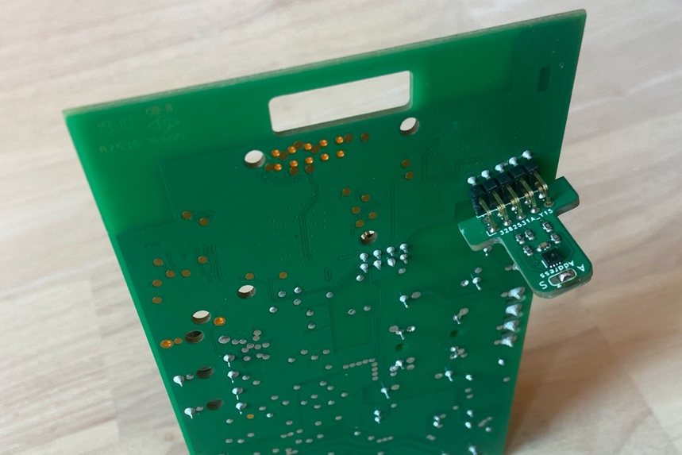

Oudere Itho modellen zonder vochtsensor zijn, met wat tweakers skills, ook uit te rusten met een temperatuur/vochtsensor.

De aansluitingen van de vochtsensor zijn als volgt en corresponderende aansluitingen op de add-on print zijn aangegeven met rode markeringen en labels.

| | |
|---|---|
| 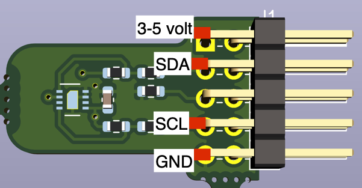 | 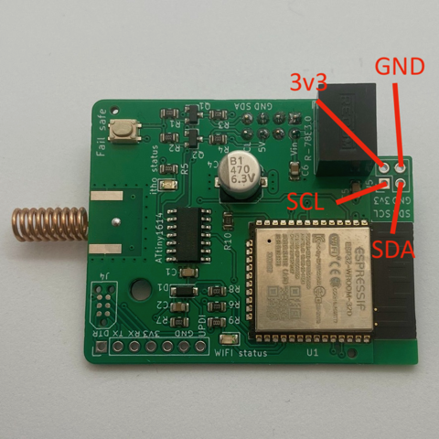 |

Hier is een voorbeeld te vinden van een tweaker die dit succesvol heeft gedaan:

<https://gathering.tweakers.net/forum/list_message/66500576#66500576>

---

## Virtual Remote

De add-on kan zich voordoen als een of meer **virtuele remotes**. Een virtuele remote emuleert een fysieke afstandsbediening volledig in software en stuurt de Itho rechtstreeks aan via de **I2C-verbinding** (de bedrade verbinding op de basisprint). Hiervoor is dus géén CC1101 RF-module nodig.

**Welke apparaten?** Virtuele remotes werken bij de via I2C aangesloten ventilatie-apparaten, zoals de CVE-familie, de HRU 350 en de HRU ECO. De meeste fan-apparaten hebben baat bij minstens één virtuele remote voor de bediening. Ze werken **niet** bij de HRU 250, HRU 300 en HRU 400; die worden uitsluitend via RF aangestuurd (zie [RF-Module](#rf-module)).

**Koppelen.** Net als een fysieke remote moet ook een virtuele remote eerst aan de Itho gekoppeld (joined) worden. De add-on kan hiervoor automatisch een join-commando sturen (optie *Send join command*, bij de eerstvolgende keer inschakelen).

**Verschil met een geëmuleerde RF-remote.** Een *virtuele remote* communiceert via de bedrade **I2C-verbinding** met de Itho; een *geëmuleerde RF-remote* communiceert **draadloos via de CC1101-module** (868 MHz), net als een fysieke afstandsbediening. Gebruik een virtuele remote bij apparaten met een I2C-verbinding, en een geëmuleerde RF-remote bij apparaten die alleen via RF werken (HRU 250/300/400) of om draadloze sensoren (zoals RFT CO2) te emuleren.

---

## RF-Module

Voor RF-functionaliteit is een CC1101-module op de add-on nodig.

De CC1101 module kan de RF-signalen van Itho-afstandsbedieningen ontvangen en versturen.
De meest verkochte afstandsbedieningen van Itho worden ondersteund.

**Een bestaande remote overzetten naar de add-on.** Een bestaande fysieke afstandsbediening kan overgezet worden naar de add-on, zodat de add-on de RF-commando's van die remote ontvangt en vertaalt naar de Itho. De remote wordt daarbij van de Itho ontkoppeld en aan de add-on gekoppeld, volgens onderstaande procedure.

> **Let op:** de keuze voor het afhandelen van RF commando's van bestaande remotes via de add-on is niet beschikbaar voor de HRU 250, HRU 300 en HRU 400. Het monitoren van RF communicatie is wel mogelijk. Laat daarom bestaande RF remotes gekoppeld aan de Itho en koppel de add-on als extra remote aan je HRU.

1. Ontleer de afstandsbediening door een leave commando te versturen binnen de eerste 2 minuten nadat je de Itho unit aan hebt gezet (op de afstandsbediening doe je dat door alle 4 de knoppen tegelijkertijd in te drukken);
2. Als je dat nog niet gedaan hebt; stel de add-on module verder in en activeer (als laatste) de RF-module onder het menu "System settings";
3. De add-on reboot;
4. Als de RF-module correct gedetecteerd is verschijnt in hetzelfde menu de optie om Itho afstandsbedieningen te beheren. Voeg pas afstandsbedieningen toe, nadat de Itho unit uit learn/leave mode is (dus minimaal 2 minuten na inschakelen) anders wordt de remote opnieuw aan de Itho gekoppeld;
5. Zet de add-on in learn/leave mode (via de web interface);
6. Verstuur een learn commando met je remote (meestal 2 diagonaal tegenover elkaar liggende knoppen tegelijkertijd indrukken, zie anders de handleiding van de specifieke remote);
7. Als het goed is komt nu je remote ID op de eerste vrije positie te staan (zie plaatje hieronder), mocht na meerdere pogingen nog niet slagen, dan kan het zijn dat de remote (nog) niet wordt ondersteund. Neem dan contact op met support.

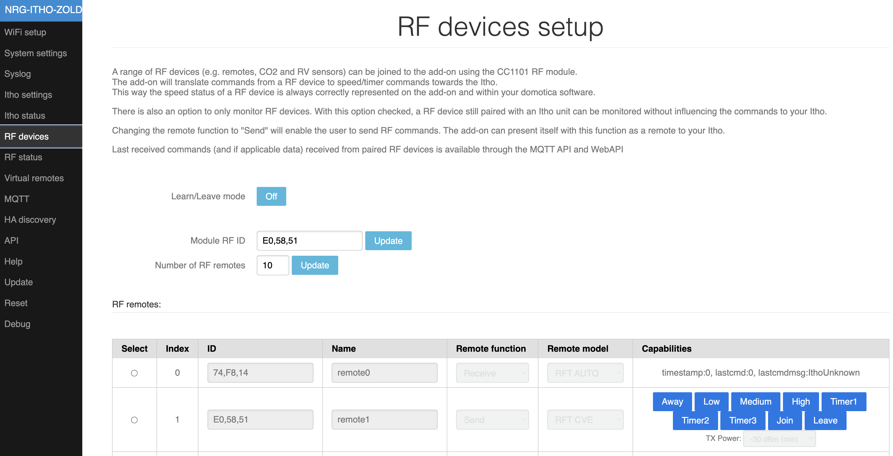

**De add-on als geëmuleerde RF-remote.** De add-on kan zich ook voordoen als een geëmuleerde RF-remote: via de CC1101-module gedraagt de add-on zich draadloos als een Itho-afstandsbediening. Met de *Remote function* op **Send** verstuurt de add-on draadloos snelheids- en timercommando's naar de Itho. Dit wordt gebruikt bij apparaten zonder bruikbare I2C-verbinding (zoals de HRU 250, HRU 300 en HRU 400) en om bijvoorbeeld een RFT CO2-sensor te emuleren.

Voordat een geëmuleerde RF-remote werkt, moet deze eenmalig aan de Itho gekoppeld (joined) worden — net als een fysieke remote. Zet de Itho daarvoor in zijn koppel-/learn-modus (zie handleiding van je Itho) en start het koppelen met de blauwe join-knop bij de betreffende remote op de **RF devices**-pagina. Daarna is de add-on te gebruiken zoals een echte fysieke remote.

**Opmerking:** Er is een debug optie om RF-commando's zichtbaar te maken in de web interface. Stel hiervoor op de **Syslog** pagina, bij *RF Debug log level*, één van de volgende niveaus in:

- **Level 1:** toont alle herkende Itho remote commando's incl. remote ID
- **Level 2:** toont alle RF-pakketten die vanaf een ingestelde remote komen (zie <https://github.com/arjenhiemstra/ithowifi/tree/master/remotes> voor meer details hoe dit te gebruiken)
- **Level 3:** toont alle RF-pakketten die verwerkt worden (hier zitten waarschijnlijk heel veel niet Itho gerelateerde pakketten tussen)
- **Level 0:** schakelt de debug-optie weer uit

De RF-log verschijnt op de **Syslog** pagina zodra het eerste RF-commando ontvangen is.

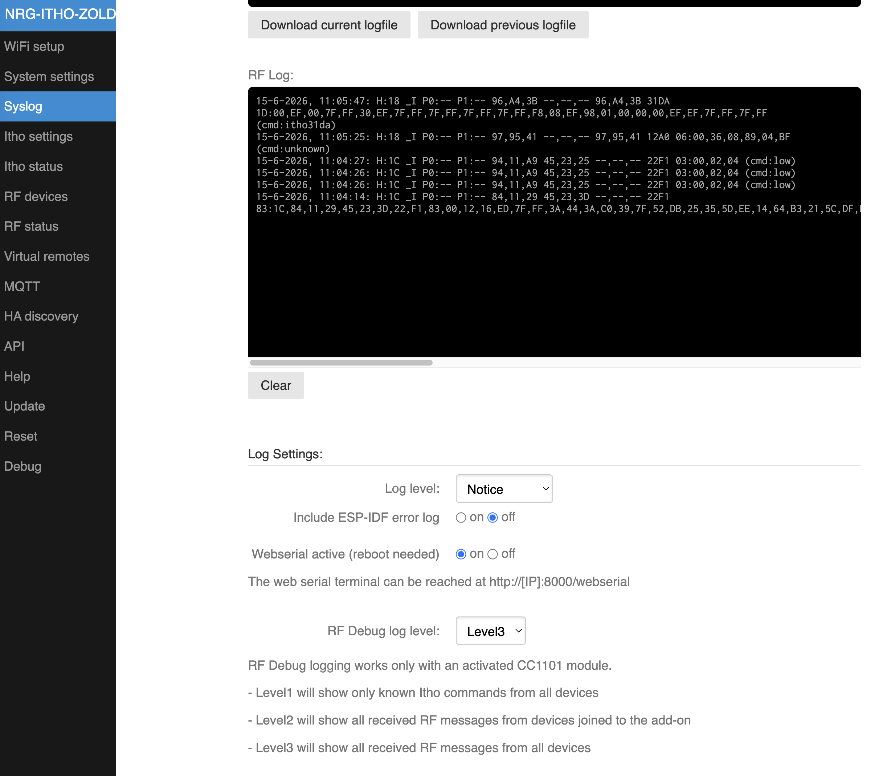

---

## Firmware bijwerken

De firmware van de add-on werk je eenvoudig bij via de web interface.

1. Open de web interface en ga naar het menu **Update**.
2. Kies welke firmware je wilt installeren:
   - **Stable** — de aanbevolen, stabiele versie.
   - **Beta** — de nieuwste testversie met de laatste functies (kan nog fouten bevatten).
3. Klik op de knop **Install**.
4. De add-on haalt de gekozen firmware automatisch op van GitHub en installeert deze. Volg de voortgang op de pagina; zodra de update klaar is, herstart de add-on automatisch.

Bij een normale update blijven je instellingen behouden. Alleen een factory reset wist de configuratie (zie [Module resetten](#module-resetten)).

**Voortgang in Home Assistant.** Beide Home Assistant-integraties — de REST- en de MQTT-variant — tonen de add-on als *update entity*; tijdens een update wordt de voortgang als voortgangsbalk getoond.

**Zelf een firmwarebestand uploaden.** Lukt het automatisch ophalen niet (bijvoorbeeld zonder internetverbinding), dan kun je op de Update-pagina ook handmatig een `.bin`-firmwarebestand uploaden. Datzelfde kan via de nood-firmware na een failsafe boot (zie [Module resetten](#module-resetten)).

---

## Module resetten

### Fail safe boot / module factory reset

Mocht het onverhoopt voorkomen dat de module door een verkeerde configuratie niet meer bereikbaar is, dan is het mogelijk om de module te booten in fail safe mode. Hierbij wordt het bestandssysteem met configuratie bestanden geformatteerd, en start de module een vereenvoudigde web interface waarmee het mogelijk is om een nieuwe firmware te flashen.

De procedure voor deze reset is als volgt:

1. reset knop indrukken
2. wachten totdat de WiFi status led snel gaat knipperen (2x per sec)
3. druk vervolgens binnen 2 sec op de "Fail save" (sommige revisies "default") knop
4. Kort hierna zal het wifi ledje 1x per seconde gaan knipperen
5. Als je geen nieuwe firmware wilt flashen, sla dan deze stop over.
   De add-on heeft nu een access point gestart met een vereenvoudige "nood" firmware. Hiermee kan alleen een nieuwe firmware geflashed worden. De webpagina is te bereiken op het volgende adres: <http://192.168.4.1/update>
   Het uploaden van een nieuwe firmware kan een minuut duren, wacht rustig af totdat de pagina refreshed en het resultaat laat zien.
6. reset knop indrukken

hierna zijn alle instellingen gewist en zal de add-on in factory default mode starten.

Er is ook een youtube filmpje beschikbaar die deze procedure laat zien:
<https://youtu.be/3sWclzq73n4>

Deze methode is alleen beschikbaar als er gebruik wordt gemaakt van een 'officiële' firmware of, een firmware die hierop gebaseerd is.

**Hardware revisies t/m 2.5** (zie achterkant add-on):

Om deze mode te activeren voor de hardware revisies t/m versie 2.5 moet een andere procedure gevolgd worden:

Verbind de twee metalen vlakjes waarbij 'failsafe' staat op de print met elkaar. Dit gaat het makkelijkst met een soldeerbout en een beetje soldeer of door de vlakjes met bijvoorbeeld een schroevendraaier met elkaar te verbinden.

Bij het aanzetten van de Itho met de add-on geinstalleerd zal de add-on de fail save procedure uitvoeren en alle instellingen verwijderen. Ook kan eventueel een nieuwe firmware geladen worden zoals eerder beschreven.

Verwijder na deze procedure de eventueel aanwezige soldeerverbinding, en neem de module weer in gebruik zoals beschreven in deze handleiding.

---

## Hmmm, maar…. Waar vind ik verdere informatie?

Er staat ontzettend veel nuttige informatie op de wiki:
<https://github.com/arjenhiemstra/ithowifi/wiki>
Deze is voor gebruikers en door gebruikers. Voel je vrij om hier ook aanpassingen te doen.

Op tweakers.net, loopt een draadje op het forum over deze add-on.
Hier staat ook meer informatie over het gebruik van deze add-on, in combinatie met bv. Home Assistant, Domoticz andere systemen.

Verder kun je daar terecht voor vragen.
De link is: <https://gathering.tweakers.net/forum/list_messages/1976492/0>

Voor verdere vragen, feedback en code aanpassingen kun je contact opnemen via <info@nrgwatch.nl> of <https://www.github.com/arjenhiemstra/ithowifi>.

---

## Hardware revisies

Afbeeldingen kunnen iets afwijken met het product dat u ontvangen heeft, de werking is echter gelijk.

**Hardware revisie 1:**

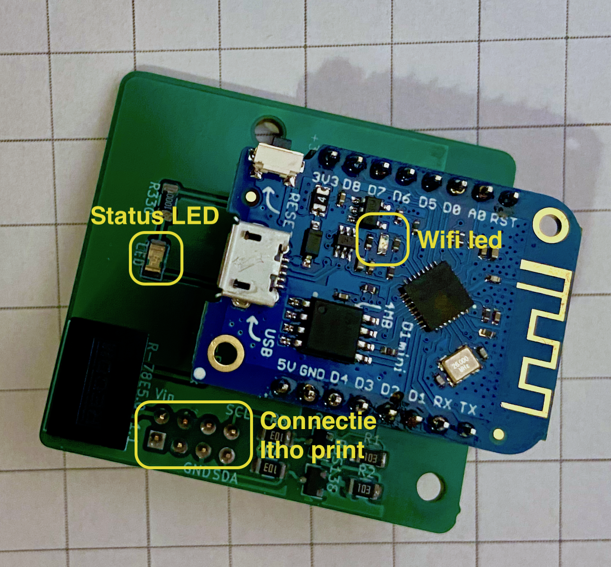

**Hardware revisie 2 (nieuwe revisies met fail safe knop):**

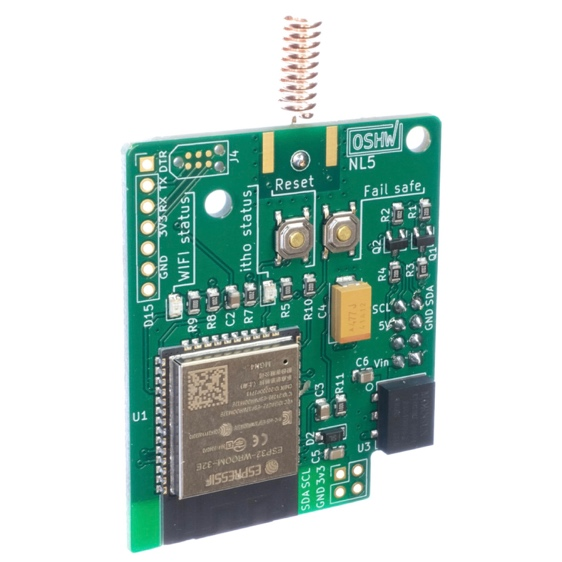

**Hardware revisie 2 (oude revisies met failsafe soldeer optie):**

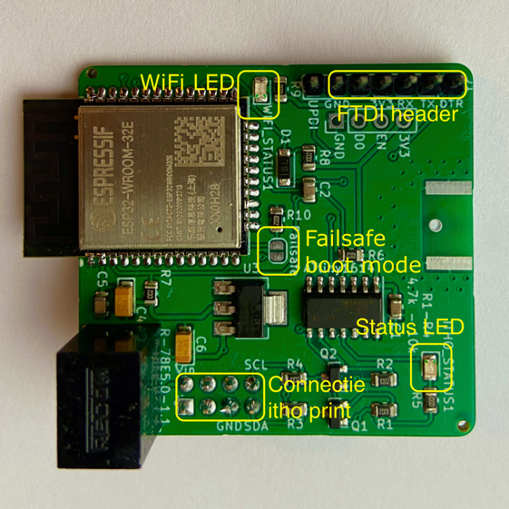

---

## Installatievoorbeeld

Installatie header voor de add-on in de rode cirkel.
Afhankelijk van de productiedatum van de Itho box, kan de print er iets anders uit zien.

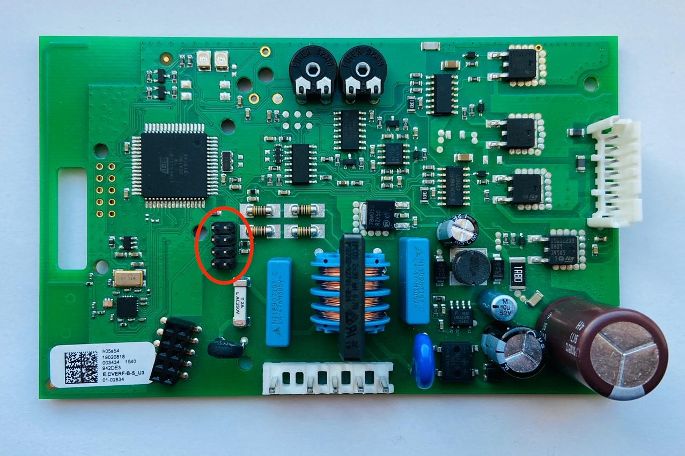

Add-on correct geïnstalleerd:

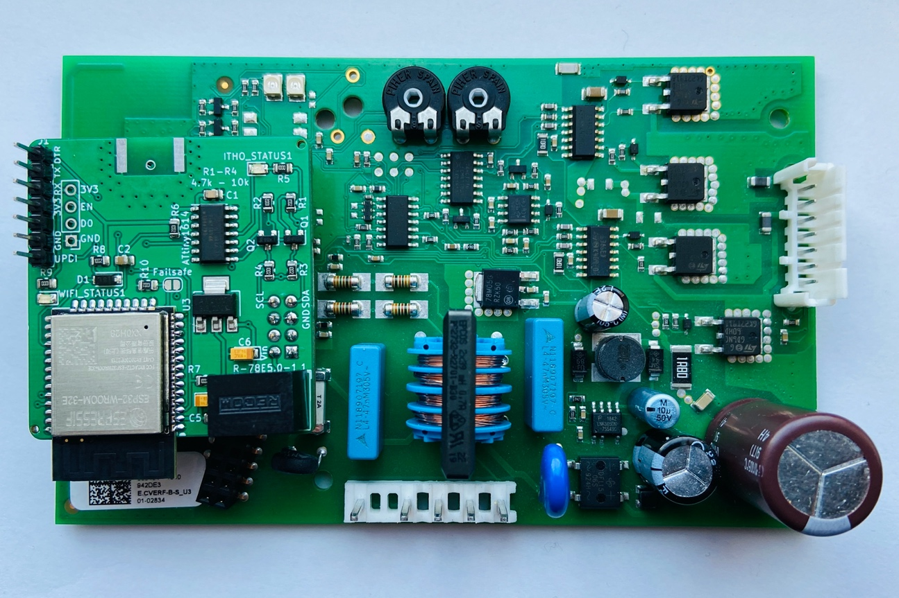

---

## Node-RED automatiseringsvoorbeeld

Hieronder treft u een Node-red voorbeeld aan:

```json
[{"id":"78e45008.cda2f","type":"mqtt out","z":"79360772.4553e8","name":"itho","topic":"itho/cmd","qos":"0","retain":"true","broker":"b4eed736.102278","x":430,"y":1000,"wires":[]},{"id":"98cc2161.c3896","type":"inject","z":"79360772.4553e8","name":"itho level 127","topic":"","payload":"127","payloadType":"str","repeat":"","crontab":"","once":false,"onceDelay":0.1,"x":170,"y":1000,"wires":[["78e45008.cda2f"]]},{"id":"5a4ffa98.c88454","type":"inject","z":"79360772.4553e8","name":"itho level 254","topic":"","payload":"254","payloadType":"str","repeat":"","crontab":"","once":false,"onceDelay":0.1,"x":170,"y":1060,"wires":[["78e45008.cda2f"]]},{"id":"1e824b95.a04104","type":"inject","z":"79360772.4553e8","name":"itho level 0","topic":"","payload":"0","payloadType":"str","repeat":"","crontab":"","once":false,"onceDelay":0.1,"x":160,"y":940,"wires":[["78e45008.cda2f"]]},{"id":"b4eed736.102278","type":"mqtt-broker","z":"","name":"MQTT Server","broker":"192.168.1.2","port":"1883","clientid":"","usetls":false,"compatmode":false,"keepalive":"60","cleansession":true,"birthTopic":"","birthQos":"0","birthPayload":"","closeTopic":"","closeQos":"0","closePayload":"","willTopic":"","willQos":"0","willPayload":""}]
```

---

## Ondersteunde afstandsbedieningen

Itho afstandsbedieningen die werkend zijn getest:

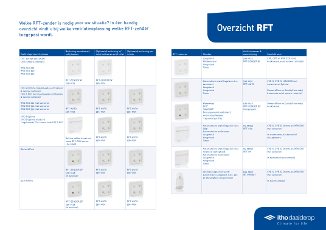
